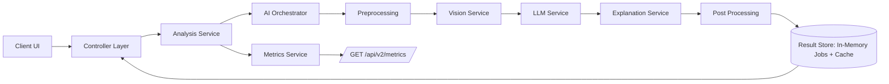

# MedXplain - Production-Oriented Explainable Medical AI

MedXplain is a full-stack system that analyzes medical report context and generates explainable AI outputs using a modular pipeline.

This version introduces a research-style workflow with:
- Structured explanation flow: Observation -> Pattern -> Diagnosis -> Confidence
- Multi-stage orchestration pipeline with retries and fallback behavior
- Async analysis jobs with polling
- Metrics tracking for latency, confidence, throughput, and mock accuracy
- Split analysis workspace in the frontend with history and follow-up Q&A

## What Is New

### Backend (v2)
- Added orchestrated AI pipeline under `/api/v2`
- Added services:
	- `vision.service.js` (mock image interpretation + heatmap simulation)
	- `llm.service.js` (mock diagnostic inference + reasoning chain)
	- `explanation.service.js` (structured XAI output + language/tone adaptation)
	- `metrics.service.js` (evaluation counters and aggregates)
- Added orchestrator:
	- `orchestrator/ai.orchestrator.js`
- Added async analysis job service with in-memory cache and polling:
	- `services/analysis.service.js`
- Added new controller and routes:
	- `controllers/analysis.controller.js`
	- `routes/analysis.routes.js`

### Frontend
- Added split workspace on report details page:
	- Left panel: input, language + doctor/patient mode, follow-up input, history, metrics snapshot
	- Right panel: diagnosis, confidence bar, structured explanation, reasoning timeline, heatmap mock
- Added reusable XAI UI components:
	- `ConfidenceBar.tsx`
	- `ReasoningSteps.tsx`
	- `AiThinkingCard.tsx`
	- `HeatmapMock.tsx`
	- `AnalysisHistoryPanel.tsx`

## How It Works

### Core Pipeline
1. Client sends analysis request to `POST /api/v2/analyze`
2. Backend queues async job with status `pending -> processing -> completed/failed`
3. Orchestrator runs:
	 - Input preprocessing
	 - Vision analysis (mock)
	 - LLM inference (mock)
	 - Structured explanation assembly
	 - Post-processing and confidence calibration
4. Result can be polled via `GET /api/v2/result/:id`
5. Metrics are aggregated and exposed via `GET /api/v2/metrics`

### Explainability Contract
Successful analysis result includes:

```json
{
	"diagnosis": "string",
	"confidence": 0.0,
	"explanation": {
		"observation": "string",
		"pattern": "string",
		"reasoning": "string",
		"conclusion": "string"
	},
	"metadata": {
		"latency": 123,
		"modelUsed": "vision-model -> llm-model"
	}
}
```

Additional fields include `reasoningSteps`, `heatmap` (for image mode), `language`, and `audienceMode`.

## Architecture



## API (v2)

All v2 routes require JWT auth.

### POST `/api/v2/analyze`
Starts an async analysis job.

Example payload:

```json
{
	"inputType": "text",
	"textInput": "Explain abnormalities in this report",
	"reportSummary": "...",
	"parameters": [],
	"language": "en",
	"audienceMode": "patient"
}
```

### POST `/api/v2/follow-up`
Follow-up Q&A using previous result context.

### GET `/api/v2/result/:id`
Returns current job state or full result.

### GET `/api/v2/history`
Returns recent analysis jobs for the authenticated user.

### GET `/api/v2/metrics`
Returns aggregated evaluation metrics:
- response time (avg/p50/p95)
- confidence average
- number of analyses
- mock accuracy
- cache hit rate

## Evaluation and Mock Dataset

A small synthetic dataset for experiments is included:
- `backend/data/mock-analysis-samples.json`

Use this dataset to quickly test:
- confidence behavior
- language and audience-mode toggles
- follow-up contextual refinement
- image-mode mock heatmap output

## Setup

### Backend

```bash
cd backend
npm install
npm run dev
```

### Frontend

```bash
cd frontend
npm install
npm run dev
```

## Validation Commands

### Backend
- `npm run dev`
- `npm test`
- `npm run lint` (requires eslint config in backend)

### Frontend
- `npm run lint`
- `npm run type-check`
- `npm run build`

## Notes

- v1 APIs remain unchanged for backward compatibility.
- v2 analysis uses deterministic mock intelligence by design (no real diagnostic model training in this stage).
- This system is educational and assistive, not a medical diagnosis tool.

## Disclaimer

This software does not provide medical advice, diagnosis, or treatment.
Always consult qualified healthcare professionals for medical decisions.
